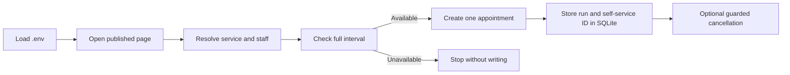

<div align="center"><a name="readme-top"></a>

# Microsoft Bookings Automation

Schedule recurring office hours without waiting on a browser.

**HTTP-first scheduling · live availability checks · local cancellation history**

[Quick Start](#-quick-start) · [Configuration](#️-configuration) · [Usage](#-usage) · [How It Works](#-how-it-works) · [Limitations](#️-safety--limitations)

<!-- SHIELD GROUP -->

[![][python-shield]][python-link]
[![][httpx-shield]][httpx-link]
[![][playwright-shield]][playwright-link]<br/>
[![][test-shield]][test-link]
[![][license-shield]][license-link]
[![][stars-shield]][stars-link]
[![][issues-shield]][issues-link]

<sup>Built for GMU GTA Office Hours and configurable for unrestricted Microsoft Bookings pages.</sup>

</div>

<details>
<summary><kbd>Table of contents</kbd></summary>

#### TOC

- [👋🏻 Overview](#-overview)
- [✨ Features](#-features)
- [🚀 Quick Start](#-quick-start)
- [⚙️ Configuration](#️-configuration)
- [📅 Usage](#-usage)
  - [Preview dates](#preview-dates)
  - [Book one appointment](#book-one-appointment)
  - [Book a configured semester](#book-a-configured-semester)
  - [Fetch the GMU semester automatically](#fetch-the-gmu-semester-automatically)
  - [Review and cancel booking runs](#review-and-cancel-booking-runs)
  - [Select a backend](#select-a-backend)
- [🧠 How It Works](#-how-it-works)
- [🛡️ Safety & Limitations](#️-safety--limitations)
- [🛠️ Development](#️-development)
- [🐞 Troubleshooting](#-troubleshooting)
- [📄 License](#-license)

<br/>

</details>

## 👋🏻 Overview

Microsoft Bookings Automation schedules recurring appointments from a small `.env` configuration. It was created for reserving a GMU GTA office-hours desk throughout a semester, including skipped holidays and breaks.

The default backend talks directly to the anonymous API used by a published Microsoft Bookings page. It resolves the current service and staff IDs, checks the complete requested interval, and submits one appointment request—without starting Chromium or requiring Microsoft Graph permissions.

> [!IMPORTANT]
>
> The HTTP backend works only when the booking owner has intentionally published an unrestricted page. It does not bypass Microsoft 365 authentication or any other access control.

<div align="right">

[![][back-to-top]](#readme-top)

</div>

## ✨ Features

### Fast HTTP scheduling

- Reuses a lightweight `httpx` session instead of rendering the Bookings UI.
- Resolves services and staff from the live page rather than hard-coding IDs.
- Uses threaded workers for concurrent, I/O-bound semester bookings.
- Retries throttled or transient **read-only** requests with backoff.

### Availability-aware booking

- Queries `GetStaffAvailability` before every appointment.
- Verifies that the selected staff member is assigned to the service.
- Checks that the full service duration fits inside an available interval.
- Stops before submission when the requested slot is unavailable.

### Conservative writes

- Sends one appointment POST only after discovery and availability succeed.
- Never automatically retries an appointment write after an ambiguous failure.
- Returns the appointment ID when Microsoft includes one in the response.

### Local history and cancellation

- Records every booking run and appointment result in an ignored SQLite database.
- Stores Microsoft customer self-service IDs only on the local machine.
- Previews bulk cancellations before sending any writes.
- Never retries a cancellation after an ambiguous response.

### Browser compatibility

The original Playwright workflow remains available as a fallback when Microsoft changes the customer-facing protocol. Recorder and inspector commands are included for repairing UI selectors.

<div align="right">

[![][back-to-top]](#readme-top)

</div>

## 🚀 Quick Start

### 1. Install

```bash
git clone https://github.com/ahnafnafee/automate-microsoft-bookings.git
cd automate-microsoft-bookings
uv sync
```

Python 3.11 or newer and [`uv`][uv-link] are required. The default HTTP backend does not require a browser download.

### 2. Configure

```bash
cp .env.example .env
```

Open `.env` and replace the example customer details and semester dates as needed. A GMU calendar dry run can be used before booking details are configured.

### 3. Preview

```bash
uv run book book-all --dry-run
```

### 4. Book

```bash
uv run book book-single 2026-08-21
```

> [!TIP]
>
> Start with one appointment. Confirm the resulting email and calendar entry before running a full semester.

<div align="right">

[![][back-to-top]](#readme-top)

</div>

## ⚙️ Configuration

The CLI loads configuration from `.env` in the repository root.

| Variable | Required to book | Default | Description |
| :--- | :---: | :--- | :--- |
| `BOOKING_URL` | Yes | — | Published Microsoft Bookings page URL |
| `BOOKING_SERVICE` | Yes | — | Exact or uniquely matching service title |
| `BOOKING_STAFF` | Yes | — | Exact or uniquely matching staff/room name |
| `BOOKING_TIME_SLOT` | Yes | — | Local business time, such as `2:00 PM` |
| `BOOKING_WEEKDAY` | No | `friday` | Recurring weekday from `monday` through `sunday` |
| `BOOKING_BACKEND` | No | `http` | `http` or `playwright` |
| `BOOKING_HTTP_TIMEOUT` | No | `20` | Per-request timeout in seconds |
| `BOOKING_HTTP_MAX_RETRIES` | No | `2` | Retries for safe discovery and availability requests |
| `BOOKING_LEDGER_PATH` | No | `.bookings/bookings.sqlite3` | Ignored SQLite run and cancellation history |
| `USER_NAME` | Yes | — | Customer name sent with the appointment |
| `USER_EMAIL` | Yes | — | Customer email sent with the appointment |
| `USER_PHONE` | No | Empty | Optional customer phone number |
| `USER_ADDRESS` | No | Empty | Optional customer address |
| `USER_NOTES` | No | Empty | Optional appointment notes |
| `SEMESTER_START_DATE` | For `book-all` | — | Inclusive start date in `YYYY-MM-DD` format |
| `SEMESTER_END_DATE` | For `book-all` | — | Inclusive end date in `YYYY-MM-DD` format |
| `SKIP_DATES` | No | Empty | Comma-separated dates to omit |

Example:

```dotenv
BOOKING_URL=https://outlook.office365.com/book/GTAOfficeHours@gmuedu.onmicrosoft.com/
BOOKING_SERVICE="Office Hours 2 Hours"
BOOKING_STAFF="ENGR 4456 D7"
BOOKING_TIME_SLOT="2:00 PM"
BOOKING_WEEKDAY=friday
BOOKING_BACKEND=http
BOOKING_LEDGER_PATH=".bookings/bookings.sqlite3"

USER_NAME="First Last"
USER_EMAIL="student@gmu.edu"
USER_NOTES="Weekly GTA office hours"

SEMESTER_START_DATE="2026-08-24"
SEMESTER_END_DATE="2026-12-07"
SKIP_DATES="2026-09-07,2026-11-27"
```

> [!NOTE]
>
> Environment files are ignored by Git. Do not commit real customer information.

<div align="right">

[![][back-to-top]](#readme-top)

</div>

## 📅 Usage

### Preview dates

List the configured recurring weekday:

```bash
uv run book list-dates
```

Preview the bulk operation without contacting the booking page:

```bash
uv run book book-all --dry-run
```

### Book one appointment

```bash
uv run book book-single 2026-08-21
```

The CLI warns before booking a date that does not match `BOOKING_WEEKDAY`.

### Book a configured semester

```bash
uv run book book-all
```

Choose the number of concurrent workers, from 1 through 16:

```bash
uv run book book-all --workers 4
```

The command prints every target date, asks for confirmation, and reports each result independently.

### Fetch the GMU semester automatically

```bash
uv run book book-semester fall 2026 --dry-run
uv run book book-semester fall 2026
uv run book book-semester fall 2026 --weekday thursday --dry-run
```

This command reads the GMU Registrar calendar, derives the semester range and closure dates, and then schedules the configured weekday. Use `--weekday` to override `.env` for one run. Calendar extraction currently uses Playwright, so install Chromium before using it:

```bash
uv run playwright install chromium
```

`--dry-run` needs no booking URL, service, staff, time slot, name, or email. Those values are validated only when a command could submit an appointment.

### Review and cancel booking runs

Successful and failed appointment attempts are grouped under a local run ID. Review the history and preview all active cancellations:

```bash
uv run book list-runs
uv run book cancel-all --dry-run
```

Cancel only one run, or constrain the selection by date:

```bash
uv run book cancel-all --run-id <run-id> --dry-run
uv run book cancel-all --run-id <run-id>
uv run book cancel-all --from-date 2026-08-24 --to-date 2026-12-07 --dry-run
```

The non-dry command asks for confirmation. Automatic cancellation applies only when Microsoft returned a customer self-service appointment ID; older or Playwright-created records without that ID remain visible as requiring manual cancellation.

### Select a backend

The environment default can be overridden per command:

```bash
uv run book book-single 2026-08-21 --backend http
uv run book book-single 2026-08-21 --backend playwright --headed
uv run book book-all --backend playwright --workers 1
```

| Backend | Best for | Tradeoff |
| :--- | :--- | :--- |
| `http` | Fast, unrestricted public-page scheduling | Uses an undocumented Microsoft customer-page protocol |
| `playwright` | UI fallback and selector troubleshooting | Requires Chromium and carries browser startup overhead |

<div align="right">

[![][back-to-top]](#readme-top)

</div>

## 🧠 How It Works



The HTTP backend follows the same anonymous workflow as the customer-facing page:

1. Follow the configured URL to `bookings.cloud.microsoft` and establish the public session.
2. Confirm that `BookingsAuthEnabled` is false.
3. Fetch current business settings, services, and staff members.
4. Resolve the configured names to their live identifiers.
5. Query staff availability for the target date and service duration.
6. Submit the appointment JSON through the page-scoped `/appointments` endpoint.
7. Store the result under a local run ID for inspection and optional cancellation.

The client sends no Microsoft Graph bearer token. The public page supplies a normal anonymous session cookie, while the request includes Microsoft’s anonymous `X-OWA-CANARY` value.

<div align="right">

[![][back-to-top]](#readme-top)

</div>

## 🛡️ Safety & Limitations

> [!WARNING]
>
> Microsoft does not document the `BookingsService/api/V1/bookingBusinessesc2` customer-page protocol as a supported external API. It may change without notice. Keep the Playwright backend available and verify behavior after Microsoft Bookings updates.

- Use this project only for pages and appointments you are authorized to book.
- Authenticated or organization-restricted pages are rejected by the HTTP backend. Microsoft documents the distinction between unrestricted and tenant-restricted booking pages in its [booking-page access-control guidance][bookings-access-link].
- Availability can change between the check and the final write. Microsoft remains the source of truth and may reject a raced slot.
- Safe reads honor `429 Retry-After` responses. Appointment writes are intentionally not retried because a lost response could otherwise create duplicates.
- Cancellation writes are also never retried. `cancel-all` targets only active records in the local database and always supports a no-write preview.
- `.bookings/bookings.sqlite3` contains customer self-service cancellation capabilities. It is ignored by Git and should be kept private and backed up with the environment file.
- The HTTP backend currently targets shared public Bookings pages, not personal Bookings pages or Microsoft Graph administration APIs.
- Required custom questions and customer verification challenges are not currently modeled; use the Playwright backend for those pages.
- High worker counts can trigger throttling or disrupt other customers. Use modest concurrency and respect the booking owner’s policies.

<div align="right">

[![][back-to-top]](#readme-top)

</div>

## 🛠️ Development

Install all dependencies and run the test suite:

```bash
uv sync
uv run pytest
```

The HTTP suite uses `httpx.MockTransport`; it exercises appointment creation without contacting Microsoft or creating a real booking.

To inspect the public UI manually:

```bash
uv run playwright install chromium
uv run book inspect
```

To record a replacement Playwright flow:

```bash
uv run book record
```

<div align="right">

[![][back-to-top]](#readme-top)

</div>

## 🐞 Troubleshooting

| Symptom | What to check |
| :--- | :--- |
| “requires Microsoft 365 authentication” | The owner restricted the page to its organization; use an authorized workflow instead |
| Service or staff not found | Copy the visible title exactly or use a unique substring |
| Slot unavailable | Confirm the date, local business time, service duration, and selected staff member |
| HTTP `429` | Reduce `--workers`; safe requests automatically honor Microsoft’s retry delay |
| HTTP protocol failure after a Bookings update | Retry with `--backend playwright` and inspect the changed page |
| Playwright executable missing | Run `uv run playwright install chromium` |

When reporting a problem, omit `.env` contents, customer information, cookies, and request tokens.

<div align="right">

[![][back-to-top]](#readme-top)

</div>

## 📄 License

Released under the [MIT License][license-link].

<!-- LINK GROUP -->

[back-to-top]: https://img.shields.io/badge/-BACK_TO_TOP-151515?style=flat-square
[bookings-access-link]: https://learn.microsoft.com/en-us/microsoft-365/bookings/customize-booking-page?view=o365-worldwide
[httpx-link]: https://www.python-httpx.org/
[httpx-shield]: https://img.shields.io/badge/HTTPX-0.28+-5A29E4?style=flat-square&logo=python&logoColor=white
[issues-link]: https://github.com/ahnafnafee/automate-microsoft-bookings/issues
[issues-shield]: https://img.shields.io/github/issues/ahnafnafee/automate-microsoft-bookings?style=flat-square&logo=github
[license-link]: ./LICENSE
[license-shield]: https://img.shields.io/github/license/ahnafnafee/automate-microsoft-bookings?style=flat-square
[playwright-link]: https://playwright.dev/python/
[playwright-shield]: https://img.shields.io/badge/Playwright-Fallback-2EAD33?style=flat-square&logo=playwright&logoColor=white
[python-link]: https://www.python.org/
[python-shield]: https://img.shields.io/badge/Python-3.11+-3776AB?style=flat-square&logo=python&logoColor=white
[stars-link]: https://github.com/ahnafnafee/automate-microsoft-bookings/stargazers
[stars-shield]: https://img.shields.io/github/stars/ahnafnafee/automate-microsoft-bookings?style=flat-square&logo=github
[test-link]: https://github.com/ahnafnafee/automate-microsoft-bookings/actions/workflows/ci.yml
[test-shield]: https://img.shields.io/github/actions/workflow/status/ahnafnafee/automate-microsoft-bookings/ci.yml?branch=main&label=tests&style=flat-square&logo=github
[uv-link]: https://docs.astral.sh/uv/
